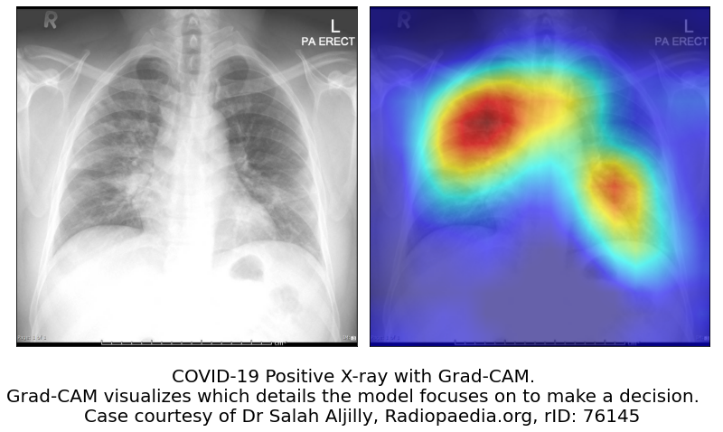

## Coronavirus disease 2019 (COVID-19) X-Ray Scanner for Diagnosis Triage


This model is meant to help triage patients (prioritize certain patients for testing, quarantine, and medical attention)
that require diagnosis for COVID-19. This model is not meant to diagnose COVID-19.

It takes both PA and AP X-ray images (in DICOM format) as inputs and outputs a prediction for each image from one
of three labels (covid, opacity, nofinding). Those predicted with the labels "covid" and "opacity", as well as additional risk factors (Age, X-ray View Position) taken from the metadata, are flagged by the model for priority action.

The model analyzes each image for features predominant to COVID-19 images and for features present in images with Lung Opacity. If the model does not detect these features from the images, it returns a "nofinding" prediction. A "nofinding" prediction does not mean the patient is not sick for other diseases. The "covid" and "opacity" labels are not mutually exclusive. Mild and severe cases of COVID-19 exhibit lung opacity in images (which is also an idicator of Pneumonia), so the ideal worst case for the model is that an image from a patient who truly has COVID-19 symptoms is misclassified as "opacity". Therefore, the patient will still get priority action. This mitigates the current lack of COVID-19 X-ray data publicly available and the problem of false-negatives for binary classifiers.

**For example**, a 54-year old patient predicted to have lung opacity is flagged as higher priority for action by the model over a 20-year old patient predicted to have symptoms of COVID-19. Both are still flagged as higher priority for COVID-19 testing compared to those who were predicted to have no findings.

[](https://www.youtube.com/watch?v=NSQoiGwCB80)

## Features


1. Classifier (A.I. model) <br/>
2. Flagging Risk Factors <br/>
3. Visualization for Classifier explainability (Grad-CAM) <br/>

## Specifications
Architecture: Resnet 34 <br/>
Training dataset: 26,000 images with weighted resampling <br/>
Training dataset size before Resampling: <br/>
1. "covid" - 186 <br/>
2. "opacity" - 5801 <br/>
3. "nofinding" - 19884 <br/>
*Note: "nofinding" images include both healthy and non-healthy lungs that do not exhibit opacity

Area under the Receiver Operator Characteristic (AUROC) was the chief metric used to determine model performance. It was calculated with a one-vs-all approach.

AUROC for "covid", "opacity", "nofinding" were at 99.97%, 92.64%, and 92.73%, respectively.

## Resources
Updated Model (Use with Pytorch; .pth) : https://www.dropbox.com/s/o27w0dik8hdjaab/corona_resnet34.pth?dl=0 <br/>

Datasets used: 1. https://github.com/ieee8023/covid-chestxray-dataset <br/>

2. https://www.kaggle.com/c/rsna-pneumonia-detection-challenge <br/>

Test_results: check the csv file in the repository <br/>

Colab_notebook (online version): check repository (Notice: <strong>NOT A DIAGNOSTIC TOOL</strong>) <br/>

## Installation (Application version)

I: Install [Docker](https://docs.docker.com/get-docker/) appropriate for your computer

II. In the terminal:

1. Clone the repository
2. Set the current directory to the root of this repository
3. Run ``` docker-compose up -d ``` 
4. After the setup is finished, it should open a new browser where the app is located.
5. To stop the application, run ``` docker-compose stop ```

## (Previous version) Coronavirus disease 2019 (COVID-19) X-Ray Scanner 
For the first iteration of the model, I built a CNN neural network that classifies a given Chest X-ray as positive for pneumonia caused by COVID-19 or not. This model is originally meant to demonstrate a proof-of-concept. The model was trained, and accepts, Posteroanterior views only. 

Rationale/More information: https://towardsdatascience.com/using-deep-learning-to-detect-ncov-19-from-x-ray-images-1a89701d1acd<br/>

## Acknowledgements

We thank Dr. Jianshu Weng, Mr. Najib Ninaba and their organisation, [AI Singapore](http://www.aisingapore.org/) (AISG), for their generous support in providing the infrastructure to train the latest iteration of the model.

## LICENSE
<a rel="license" href="https://opensource.org/licenses/MIT"></a>
